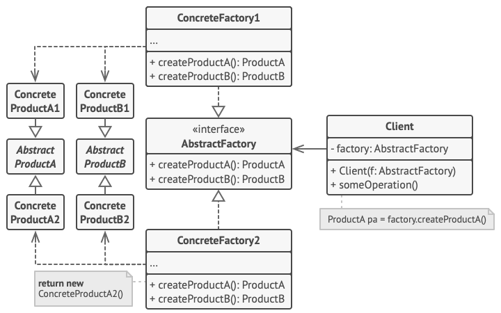

# Abstract factory
The abstract factory is a design pattern that provides a way to create families of related objects without imposing their concrete classes, by encapsulating a group of individual factories that have a common theme without specifying their concrete classes.
According to this pattern, a client software component creates a concrete implementation of the abstract factory and then uses the generic interface of the factory to create the concrete objects that are part of the family. The client does not know which concrete objects it receives from each of these internal factories, as it uses only the generic interfaces of their products. This pattern separates the details of implementation of a set of objects from their general usage.

## Overview
The abstract factory may be used to solve problems such as:
- How can an application be independent of how its objects are created?
- How can a class be independent of how the objects that it requires are created?
- How can families of related or dependent objects be created?

Creating objects directly within the class that requires the objects is inflexible because doing so commits the class to particular objects and makes it impossible to change the instantiation later independently from the class without having to change it. It prevents the class from being reusable if other objects are required, and it makes the class difficult to test because real objects cannot be replaced with mock objects.

A factory is the location of a concrete class in the code at which objects are constructed. Implementation of the pattern intends to insulate the creation of objects from their usage and to create families of related objects without having to depend on their concrete classes. This allows for new derived types to be introduced with no change to the code that uses the base class.

The pattern describes how to solve such problems:

- Encapsulate object creation in a separate (factory) object by defining and implementing an interface for creating objects.
- Delegate object creation to a factory object instead of creating objects directly.

This makes a class independent of how its objects are created. A class may be configured with a factory object, which it uses to create objects, and the factory object can be exchanged at runtime.

## Structure

1. Abstract Products declare interfaces for a set of distinct but related products which make up a product family.
2. Concrete Products are various implementations of abstract products, grouped by variants. Each abstract product (ProductA/ProductB) must be implemented in all given variants (1/2).
3. The Abstract Factory interface declares a set of methods for creating each of the abstract products.
4. Concrete Factories implement creation methods of the abstract factory. Each concrete factory corresponds to a specific variant of products and creates only those product variants.
5. Although concrete factories instantiate concrete products, signatures of their creation methods must return corresponding abstract products. This way the client code that uses a factory doesn’t get coupled to the specific variant of the product it gets from a factory. The Client can work with any concrete factory/product variant, as long as it communicates with their objects via abstract interfaces.

## Implementation
1. Declare `abstract product interfaces` for all product types. Then make all `concrete product classes` implement these interfaces.
2. Declare the `abstract factory interface` with a set of creation methods for all abstract products. These methods must return abstract product types represented by the interfaces.
3. Implement a set of `concrete factory classes`, one for each product variant.
4. Create factory initialization code somewhere in the app. It should instantiate one of the concrete factory classes, depending on the application configuration or the current environment. Pass this factory object to client code that construct products.
5. Use the appropriate creation method of the factory object instead of direct calls to product constructors to create products.
6. The client code has to work with both factories and products via their respective abstract interfaces. This lets you change the type of a factory that you pass to the client code, as well as the product variant that the client code receives, without breaking the actual client code.
